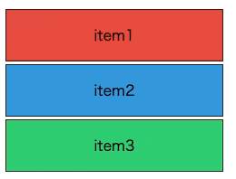

# React Simple DnD List



- ドラッグアンドドロップで並び替えをするReactコンポーネントライブラリです。
- スタイルは提供しません。
- 縦方向のみのシンプルな挙動です。

## 使い方

package.json の　dependencies　に以下を追記して `npm install` を実行してください。

```json
"react-simple-dnd-list": "github:ANTON072/react-simple-dnd-list"
```

サンプルコード

```tsx
import { useState } from "react";
import { DragDropContext, Draggable, reorder } from "react-simple-dnd-list";

function App() {
  const [items, setItems] = useState([
    { id: "id_a", name: "item1" },
    { id: "id_b", name: "item2" },
    { id: "id_c", name: "item3" },
  ]);

  return (
    <DragDropContext
      onDragEnd={(result) => {
        const newOrder = reorder(
          items,
          result.sourceIndex,
          result.destinationIndex
        );
        setItems(newOrder);
      }}
    >
      <ul>
        {items.map((item, index) => (
          <Draggable key={item.id} draggableId={item.id} index={index}>
            {(provided) => (
              <li className={item.id} {...provided.draggableProps}>
                {item.name}
              </li>
            )}
          </Draggable>
        ))}
      </ul>
    </DragDropContext>
  );
}
export default App;
```
